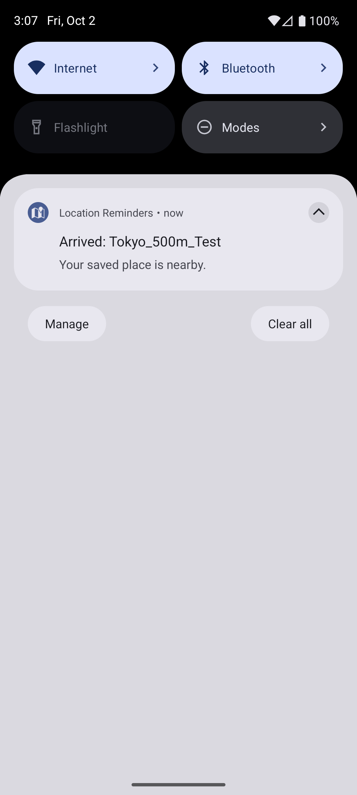

# Verification on the Mac emulator

Tested 2026-10-02 on the existing `Medium_Phone_API_36.0` emulator (`emulator-5554`), Android 16 / API 36, `arm64-v8a`, Google Play system image. `sys.boot_completed` was `1`, and `com.google.android.gms` was installed. No API keys, Google account sign-in, payments, or billing setup were used.

## Passed

| Check | Observed result |
| --- | --- |
| Debug build | `./gradlew assembleDebug` succeeded. APK installed with `adb install -r`. |
| Correct launch activity | `com.radwan.locationalert/.MainActivity` launched successfully, including a COLD launch. |
| OpenStreetMap without a key | Tokyo and Dhaka map tiles (including Japanese and Bengali labels) and attribution were visible on the emulator. No embedded Maps SDK key exists. |
| Location permission | Android displayed precise/approximate location choices and the foreground permission prompt. Precise foreground access was granted through the UI. |
| Notification permission | Android displayed the notification permission prompt; Allow was selected. Package inspection confirmed `POST_NOTIFICATIONS` granted. |
| Background permission | The app explained the Settings step. Android's location permission screen accepted Allow all the time; package inspection confirmed background access granted. |
| Location selection | Tokyo/Dhaka shortcuts updated selected coordinates. A map tap changed selected coordinates. Manual latitude/longitude fields appeared in the reminder editor. |
| Save a 500 m reminder | `Tokyo_500m_Test`, 35.681236 / 139.767125, radius 500, was saved using the app UI and displayed as Active after real Play services registration. |
| Persistence after reopening | A full `am force-stop` followed by `am start -W` produced a COLD launch. The saved test reminder and pre-existing reminder remained in the list; Play services registration was restored. |
| Real outside-to-inside notification | With an outside GPS/fused fix at approximately 35.60 / 139.70, then an inside fix at 35.681236 / 139.767125, Android posted **Arrived: Tokyo_500m_Test**. The notification was observed in the notification shade and `dumpsys notification`, and the reminder changed to Reminded. No synthetic receiver intent was used. |
| Deleting a reminder | Deleted only `Tokyo_500m_Test` through its Delete button. Reopened the list and inspected local storage: the test reminder was absent and the pre-existing reminder remained Active. |
| Storage tests | Direct Android instrumentation returned `OK (3 tests)` on the final app implementation. The tests cover Unicode Japan/Bangladesh names, signed worldwide coordinates, persistence, status updates, deletion, and malformed storage recovery in isolated test preferences. |
| Lint | `./gradlew lintDebug` succeeded after fixes; nonfatal dependency-update, localization, and synchronous preference-write warnings remain. |
| Crash check | Crash-buffer logcat was empty after final build installation and UI/movement tests. No app FATAL EXCEPTION or ANR was found in the captured final session. |

Final-build notification evidence:

The final session logged geofence restoration at emulator time 15:06:35 and `Arrival notification delivered: Tokyo_500m_Test` at 15:07:13. Android's notification record independently contained title `Arrived: Tokyo_500m_Test`, text `Your saved place is nearby.`, and channel `arrivals`.

## Failed initially, then resolved

- The source repository had no Gradle project, packaged activity, imports, modern permission flow, or notification channel. Added a complete project and retained the original snippets unchanged.
- The first real geofence registration returned `ApiException: 1000` while the emulator's Google Location Accuracy was off and its network location provider was disabled. Enabled Improve Location Accuracy through Android Settings; registration succeeded. The app now displays a useful Settings/retry message for this error.
- Lint initially reported numeric orientation constants and a geofencing permission-check recognition error. Replaced orientation literals with named constants and added explicit handling for a revoked permission; the subsequent lint run passed.
- The search field initially used a pixel height that clipped text on the emulator. Changed it to measure its content and verified the field rendered fully.

No requested core check remains failed after retesting.

## Unverified / remaining limitations

- Geoapify tiles with a real key and the optional external Google Maps handoff were not tested. Neither is required for default operation.
- Boot restoration is implemented but not verified across an actual reboot. Physical devices, Doze/OEM restrictions, and long-running background delivery were not tested. Arrival delivery may take minutes.
- Future date/time eligibility is implemented, but a real delayed arrival across that time was not tested. The timestamp gates arrival events; it is not an alarm that fires solely because the time has passed.
- Offline persistence is covered by local storage and reopen checks, but an airplane-mode end-to-end test was not run. Uncached tiles and search require network.
- Worldwide coordinate/Unicode storage is instrumented; exhaustive worldwide geocoding coverage and every Japanese/Bangladeshi place name were not tested. The interface remains English.
- Denying/revoking all permission combinations and stress testing 100 geofences were not exercised.

## Preservation and final state

The original tracked snippet files were not modified. A separately created implementation branch holds app code, tests, and documentation. Existing emulator reminders were retained; the temporary Tokyo test reminder was removed. Keys, local SDK configuration, SDK/emulator files, caches, generated APKs, and build reports are excluded from Git. The app is left open in the emulator. No merge or release publication is performed.
